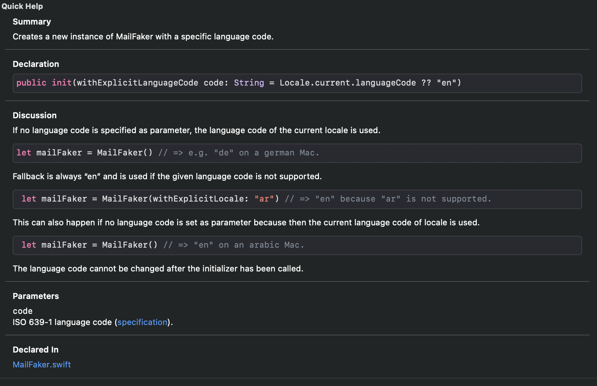

<p align="center">
  
</p>

<p align="center">
  
  
  
  
</p>

## Installation

MailFaker is currently only available via Swift Package Manager (SPM). It is not planned to implement support for CocoaPods or Carthage - but feel free to make a pull request.

```Swift
// Add MailFaker to your Package.swift:

import PackageDescription

let package = Package(
    // ...
    dependencies: [
        .package(url: "https://github.com/AiondaDotCom/MailFaker", from: "1.0.0"),
    ]
    // ...
)
```

**Xcode >=11**: *File* -> *Swift Packages* -> *Add Package Dependency...*

## Usage

```Swift
// Add MailFaker to your class
import MailFaker

// Create an instance of MailFaker
let mailFaker = MailFaker()

// Generate random names and emails
mailFaker.firstName()       // => A random first name
mailFaker.lastName()        // => A random last name
mailFaker.fullName()        // => A random full name
mailFaker.localPart()       // => A random local-part of an email address
mailFaker.domainPart()      // => A random domain-part of an email address
mailFaker.fullAddress()     // => A random email address
```

## Examples

The following code examples should only give a short overview of the features of MailFaker. A detailed documentation is shown in Xcode.

_Initialize MailFaker_

```Swift
let mailFaker = MailFaker() 
// => language code of the current locale (e.g. "de") will be used.

let mailFaker = MailFaker(withExplicitLocale: "fr") 
// => language code "fr" will be used.

// Fallback is always "en" and is used if the given language code is not supported.
```

_Generate first names_

```Swift
mailFaker.firstName(.female)    // e.g. Manuela
mailFaker.firstName(.male)      // e.g. Benedikt
mailFaker.firstName()           // e.g. Peter

// mailFaker.firstName() is equal to mailFaker.firstName(.random)
```

_Generate last names_

```Swift
mailFaker.lastName()    // e.g. Müller
```

_Generate full names_

```Swift
mailFaker.fullName(.female)     // e.g. Lisa Müller
mailFaker.fullName(.male)       // e.g. Markus Urban
mailFaker.fullName()            // e.g. Sabine Meier 

// mailFaker.fullName() is equal to mailFaker.fullName(.random)
```

_Generate local-parts of email addresses_

```Swift
mailFaker.localPart(.female)     // e.g. reitze_anabel-3377
mailFaker.localPart(.male)       // e.g. danneberg.mark_1823
mailFaker.localPart()            // e.g. 3714.patrick-gabius 

// mailFaker.localPart() is equal to mailFaker.localPart(.random)
```

_Generate domain-parts of email addresses_

```Swift
mailFaker.domainPart()    // e.g. dolor.fr
```

_Generate full email addresses_

```Swift
mailFaker.fullAddress(.female)     // e.g. 9792.krippner-nisa@lorem.de
mailFaker.fullAddress(.male)       // e.g. tiago_dies-8420@molestiae.americanexpress
mailFaker.fullAddress()            // e.g. 2245.schirmer-michaela@dicta.net

// mailFaker.fullAddress() is equal to mailFaker.fullAddress(.random)
```

## Documentation

All code is fully documented and uses the [Apple Markup Formatting Reference](https://developer.apple.com/library/archive/documentation/Xcode/Reference/xcode_markup_formatting_ref/index.html).



## License

MailFaker is available under the MIT license. See [LICENSE.md](LICENSE.md) for more info.

This project was inspired and contains data from: [faker.js](https://github.com/Marak/faker.js).